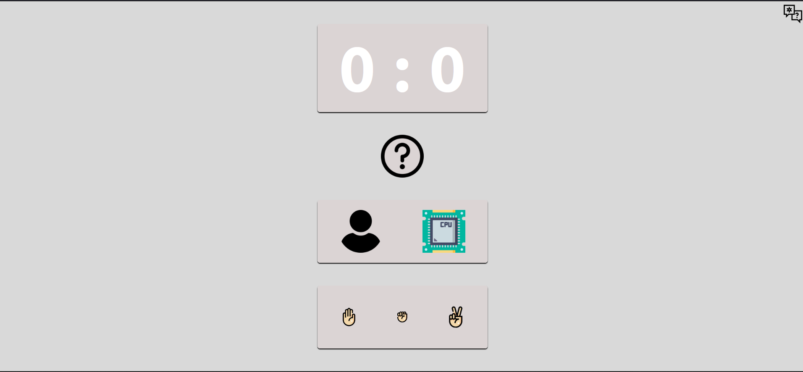
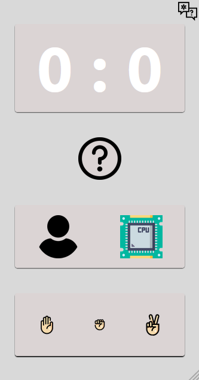

# Platzi - Rock Paper and Scissors

## Table of contents

- [Overview](#overview)
  - [Screenshot](#screenshot)
  - [Links](#links)
- [Built with](#built-with)
- [Author](#author)

## Overview
This is a solution to the [Project of the 12th and 13th class of the basic course of JavaScript](https://platzi.com/clases/1814-basico-javascript/26303-arrays/).

### Screenshot

### Links
- Solution URL: [GitHub](https://github.com/ButchBet/Rock-Paper-and-Scissors-)
- Live Site URL: [RPAS](https://rpasbutchbet.netlify.app/)

### Built with
- Semantic HTML5 markup
- CSS custom properties
- Flexbox
- Mobile-first workflow
- JS vanilla

## Author
- Website - [Butchbet](none)
- Twitter - [@JustButchBet](https://twitter.com/JustButchBet)